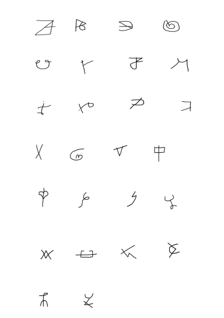

# XENOGLYPH: CUSTOM LANGUAGE RECOGNITION

## A Deep Learning-Based Image Recognition and Classification System built using Convolutional Neural Network (ResNet-18 architecure) for Synthesized Alien Script Detection. 

### Project Objective 
As a fusion of creativity and technology, this project emphasizes leveraging image recognition and computer vision technologies to demonstrate the model's capability to work on unknown language datasets (alien in creative terms) through visual pattern learning, independent of linguistic rules. 
Through this experimental dataset, the primary objective is to evaluate the classification accuracy and prediction capability of a CNN on new language data through supervised learning approach,thus acting as a conceptual proof for future sequence and sentence-level translation or script recognition tasks. 

The project focused more on dataset creation, data augmentation, classification, and predictive accuracy of a ResNet-18 classier on unknown, CV-driven symbols. A minimal UI is included to demonstrate the conceptual functionalities of a real-time prediction pipeline. 
Developed for research and development purposes, the system is designed to be extensible to different custom datasets, inputted through canvas and trained on model for evaluation. Through its interactive canvas UI, it serves as a foundational framework for digital handwriting feedback system and motor-skill assistance tool for children and people with motor impairments. 


### Tech Stack used (complete pipeline): 
**Frontend:** React.js, React-Sketch-Canvas, axios, and Bootstrap for styling. <br>
**Backend:** Node.js, Express.js, CORS, nodemon, dotenv, body-parser. <br>
**ML Microservice:** FastAPI, Uvicorn, PyTorch, Torchvision, Pillow(PIL), Numpy, OpenCV. <br>
**Deployment & DevOps:** Docker (containerization of frontend, backend, and ML microservice). 

### Language Dataset: 



### Local Setup (Development)
```bash
# Frontend
cd frontend
npm install                               # Install dependencies
npm start                                 # Start the client application

# Backend
cd backend
npm install                               # Install dependencies
npm run dev                               # Start Express server

# ML Microservice  
cd ml-service                
python -m venv venv                       # Create and Activate virtual environment 
venv\Scripts\activate                     # Windows
source venv/bin/activate                  # Linux / macOS
pip install -r requirements.txt           # Install dependencies
uvicorn app:app --reload --port 8000      # Start FastAPI server

# Docker Services 
docker compose build                      # Build all images
docker compose up                         # Start frontend + backend + ML service
docker images                             # check built images 
docker ps                                 # verify running containers
docker compose down                       # Stop all containers, if needed.
